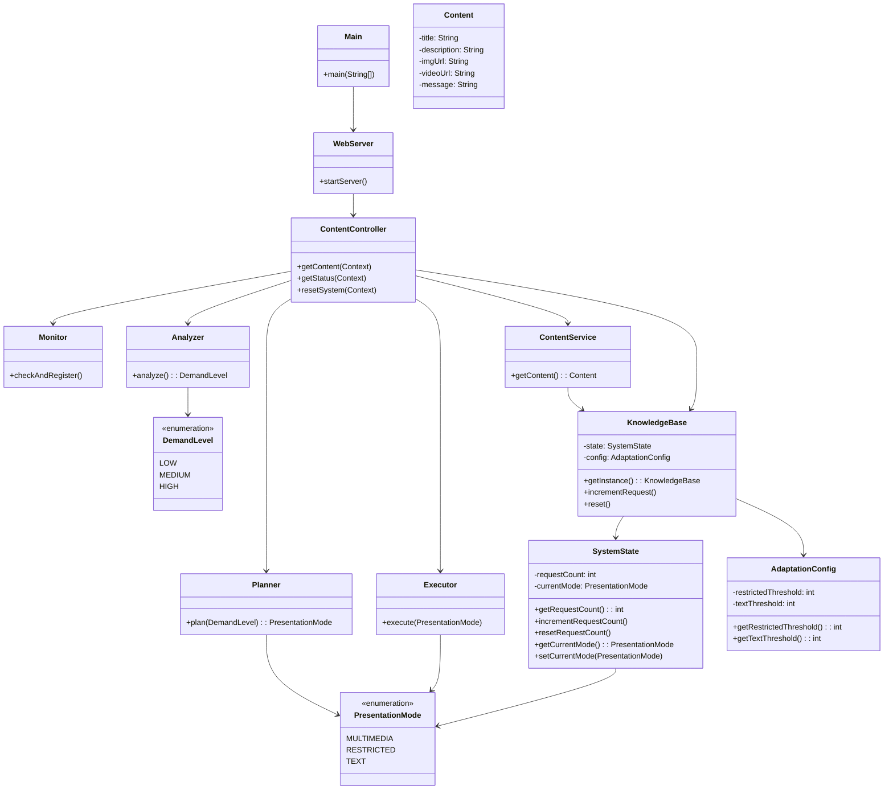

# Taller de Programación 2 - Sistema Web Autoadaptativo MAPE-K

## 1. Descripción general
Este proyecto implementa un sistema web autoadaptativo en Java usando Maven y Javalin.
El servidor expone tres endpoints:
- `GET /content` - devuelve contenido educativo según el modo de presentación activo.
- `GET /status` - muestra el estado actual del sistema y los umbrales configurados.
- `GET /reset` - reinicia la simulación, dejando el contador en cero y el modo en `MULTIMEDIA`.

El sistema aplica la arquitectura MAPE-K:
- `Monitor` registra cada solicitud a `/content`.
- `Analyzer` evalúa el nivel de demanda según los umbrales de `Knowledge`.
- `Planner` decide el modo de presentación a activar.
- `Executor` aplica el cambio de modo en `Knowledge`.
- `KnowledgeBase` mantiene el estado actual y la configuración de adaptación.

## 2. Estructura del proyecto

```
src/main/java/
  app/Main.java
  knowledge/KnowledgeBase.java
            /SystemState.java
            /AdaptationConfig.java
            /PresentationMode.java
  mape/Monitor.java
       /Analyzer.java
       /Planner.java
       /Executor.java
       /DemandLevel.java
  web/WebServer.java
      /ContentController.java
  service/ContentService.java
  model/Content.java
```

## 3. Diagrama de clases



> Nota: este diagrama es una representación de la organización de clases y sus relaciones.

## 4. Componentes MAPE-K implementados

- `Monitor` (`mape.Monitor`): incrementa el contador de solicitudes en `KnowledgeBase` y registra el evento en consola.
- `Analyzer` (`mape.Analyzer`): lee el número de solicitudes actuales y compara con los umbrales `restrictedThreshold` y `textThreshold`.
- `Planner` (`mape.Planner`): mapea `DemandLevel` a `PresentationMode`.
- `Executor` (`mape.Executor`): actualiza el modo activo en `KnowledgeBase` si es necesario.
- `Knowledge` (`knowledge.KnowledgeBase`): implementado como un `Singleton` que guarda `SystemState` y `AdaptationConfig`.

## 5. Mecanismo de Knowledge

`KnowledgeBase` almacena:
- `SystemState`:
  - `requestCount` (contador de solicitudes a `/content`)
  - `currentMode` (modo activo: `MULTIMEDIA`, `RESTRICTED`, `TEXT`)
- `AdaptationConfig`:
  - `restrictedThreshold = 10`
  - `textThreshold = 20`

La implementación actual usa una clase singleton en memoria como repositorio de conocimiento. Esto permite mantener el estado del sistema y los parámetros de adaptación durante la ejecución.

## 6. Instalación y ejecución

### Requisitos
- Java 23
- Maven

### Ejecutar el servidor

```bash
mvn clean compile exec:java -Dexec.mainClass="app.Main"
```

O bien, construir el paquete y ejecutar el JAR resultante:

```bash
mvn clean package
java -cp target/classes;path/to/dependencies app.Main
```

### Endpoints disponibles

- `GET http://localhost:7000/content`
- `GET http://localhost:7000/status`
- `GET http://localhost:7000/reset`

## 7. Prueba de carga externa

Se puede usar `curl`, `Apache Bench`, `Postman`, `JMeter` o `k6` para generar peticiones.

### Ejemplo con `curl` en un bucle

```bash
for i in {1..25}; do curl -s http://localhost:7000/content > /dev/null; done
curl http://localhost:7000/status
```

### Ejemplo con `Apache Bench`

```bash
ab -n 25 -c 5 http://localhost:7000/content
```

### Umbrales configurados

- `0-9` solicitudes => `MULTIMEDIA`
- `10-19` solicitudes => `RESTRICTED`
- `20+` solicitudes => `TEXT`

## 8. Ejemplos de respuesta

### `/content` en modo `MULTIMEDIA`
```json
{
  "title": "Patrones de Software",
  "description": "Aprendamos de buenas prácticas",
  "imgUrl": "https://mi-servidor.com/imagenes/arquitectura.png",
  "videoUrl": "https://mi-servidor.com/videos/clase_mapek.mp4",
  "message": null
}
```

### `/content` en modo `RESTRICTED`
```json
{
  "title": "Patrones de Software",
  "description": "Aprendamos de buenas prácticas",
  "imgUrl": "https://mi-servidor.com/imagenes/arquitectura.png",
  "videoUrl": null,
  "message": null
}
```

### `/content` en modo `TEXT`
```json
{
  "title": "Patrones de Software",
  "description": "Resumen: Diseño de sistemas autoadaptativos.",
  "imgUrl": null,
  "videoUrl": null,
  "message": "Las imágenes, videos y enlaces multimedia fueron desactivados temporalmente debido a alta demanda."
}
```

### `/status`
```json
{
  "mode": "TEXT",
  "requests": 25,
  "restrictedThreshold": 10,
  "textThreshold": 20
}
```

## 9. Evidencia del ciclo MAPE-K

Al recibir una petición a `/content`, el servidor imprime en consola mensajes como:

- `[MONITOR] Solicitud se ha registrado. Solicitudes actuales: X`
- `[Analyze] Se detectó demanda baja/medio/alta`
- `[PLAN] Activar modo multimedia/restringido/texto.`
- `[EXECUTE] El sistema cambio a modo RESTRICTED/TEXT.`

Estos mensajes muestran la ejecución del ciclo MAPE-K en cada solicitud.

## 10. Notas adicionales

- El diseño del sistema separa claramente los componentes MAPE-K del controlador web y del servicio de contenido.
- El proyecto usa Javalin para ofrecer un servidor web ligero y JSON como formato de respuesta.
- El estado de adaptación se conserva en memoria a través de `KnowledgeBase`.

---

**Entrega:** código fuente completo, `pom.xml`, `README.md`, diagrama de clases incluido en este archivo, evidencia del ciclo MAPE-K y prueba externa de carga.
